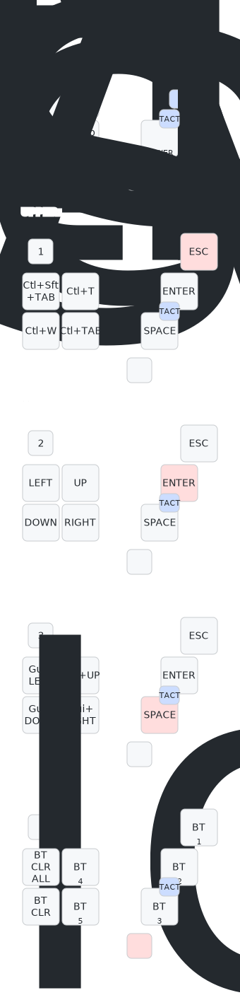

user-config形式で使用することも目的としてフォークしたリポジトリを一部変更しています。

# MoooseMini
55mm大玉搭載の自作マウス"MoooseMini"のZMK-Configリポジトリです。  

## 特徴
・ZMK Firmware採用で有線/無線可能  
・ZMK Studio対応  
・ロータリーエンコーダ対応  
・最大8キー(MX互換)+1タクトスイッチ  
・ロック機能付きトラボ筐体  

## 詳細
[プロジェクトページ](https://github.com/ataruno/MoooseMini/tree/main)  
[ビルドガイド](https://github.com/ataruno/MoooseMini/blob/main/doc/build_guide.md)  
[ZMK-Configリポジトリ](https://github.com/ataruno/zmk-MoooseMini)  

### FIRMWARE  
Special thanks to the people behind the ZMK project:  
- [Pete Johanson](https://github.com/petejohanson)  
- [Cem Aksoylar](https://github.com/caksoylar)  
- And all the [ZMK Contributors](https://github.com/zmkfirmware/zmk/graphs/contributors)  

